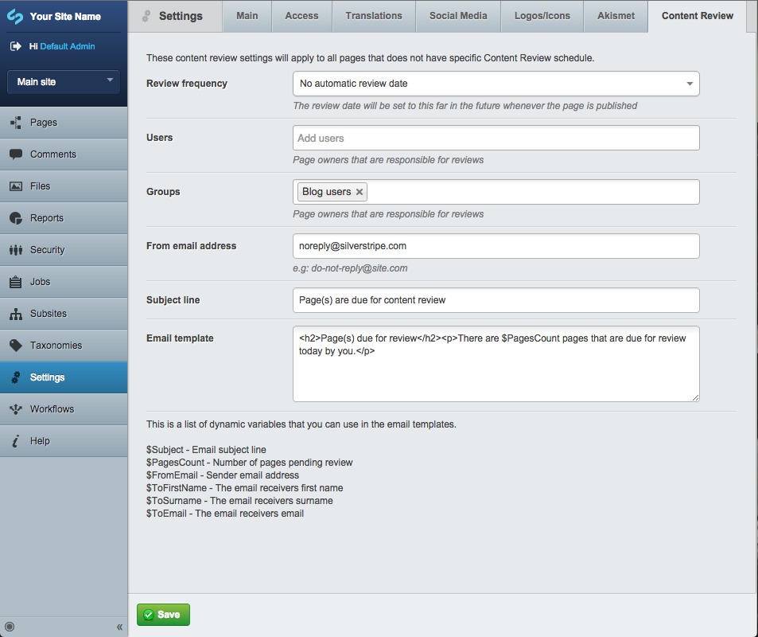
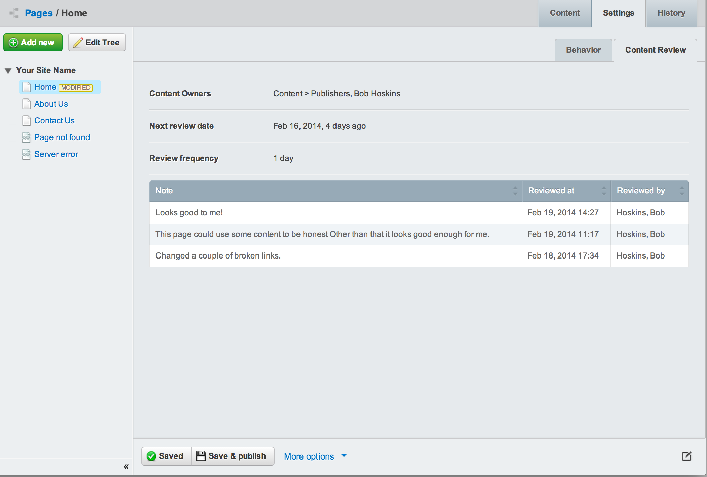
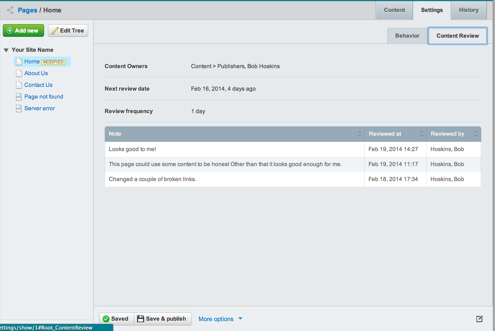

# Content Review module

[](https://travis-ci.org/silverstripe/silverstripe-contentreview)
[](https://scrutinizer-ci.com/g/silverstripe/silverstripe-contentreview)
[](https://packagist.org/packages/silverstripe/contentreview)
[](license.md)

This module helps keep your website content accurate and up-to-date, which keeps your users happy.

It does so by sending reviewers reminder emails to go in and check the content. For a reviewer this
often includes checking links, grammar, factual information and look and feel.

There are two types of roles with this module.

 * Website owner; (typically assigned to the Administrator group) ensures that a website is accurate and up-to-date, by delegating responsibility to content reviewers.
 * Content reviewer; responsible for keeping a website or part of a website accurate and up-to-date.

## Features

 * Content reviewer will receive an email notification when a page is due for review.
 * Content reviewer can mark a page as 'reviewed', and provide review notes.
 * Website owner can assign content reviewers to a page and set when the content should be reviewed.
 * Website owner can see a report of pages and their reviewed status.
 * Content reviewers can be assigned to a page, a page and all sub-pages, or globally.
 * The content review schedule can be automatic, e.g. every month, and/or a specific date.

## Requirements

 * SilverStripe Framework and CMS

## Composer installation

```sh
$ composer require silverstripe/contentreview
```

## Manual installation

Download or clone the source code into the SilverStripe root folder. Rename the module folder
to `contentreview`.

Run dev/build either via the webserver by opening the url `http://<your-host>/dev/build` or
by running the dev/build via a CLI.

## Configuration

In order for the contentreview module to send emails, you need to *either*:

 * Setup the DailyTask script to run daily via cron. See framework/tasks/ScheduledTask.php for more information on setup.
 * Install the queuedjobs module, and follow the configuration steps to create a cron job for that module. Once installed, you can just run dev/build to have a job created, which will run at 9am every day by default.

Global settings can be configured via the global settings admin in the CMS under the "Content Review" tab.
This includes global groups, users, as well as a template editor that supports a limited number of variables.



## Usage

To set up content review schedules you need to log in as a user with the 'Set content owners and review dates' permission. This can either
be an administrator who has all permissions, or by giving a group the specific permission.


To set a content review schedule for a page go to `Settings > Content Review`.



CMS users without the permission to change the content review schedule can still see the settings
and previous reviews in the same view, but cannot change anything.



## Testing

cd to the site root, and run:

```sh
$ php vendor/bin/behat
```

or to test this module when used on a website:

```sh
$ php vendor/bin/behat contentreview/tests
```

## Migration

If you are upgrading from an older version, you may need to run the `ContentReviewOwnerMigrationTask`
